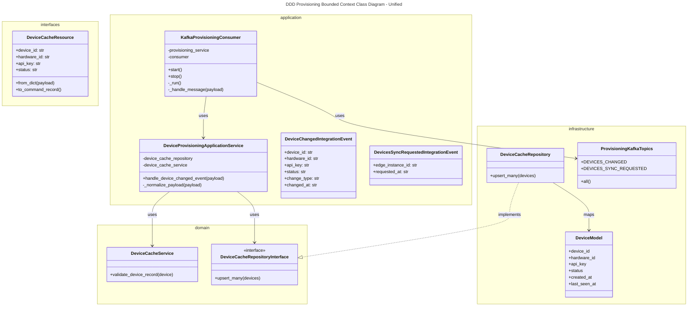
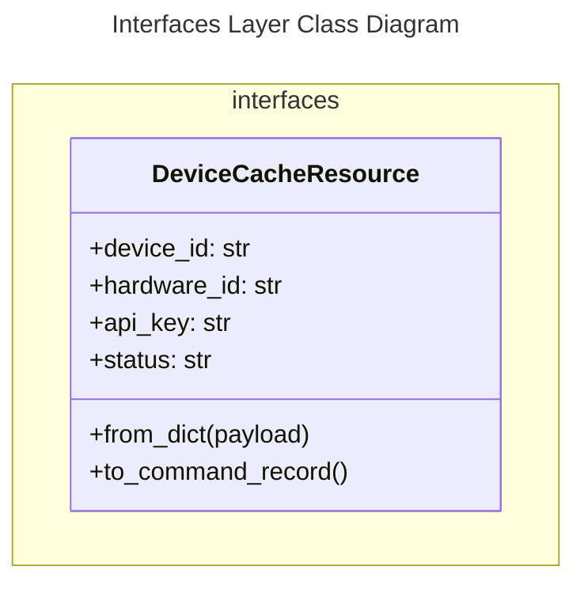
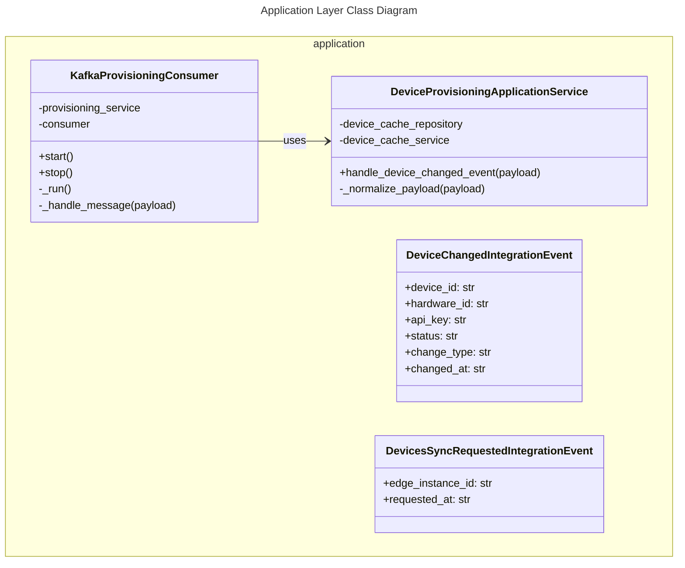
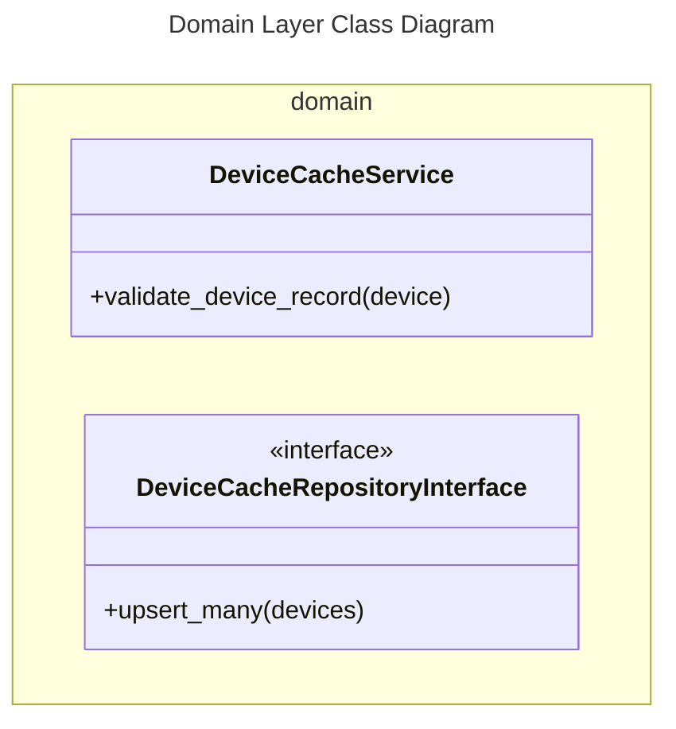
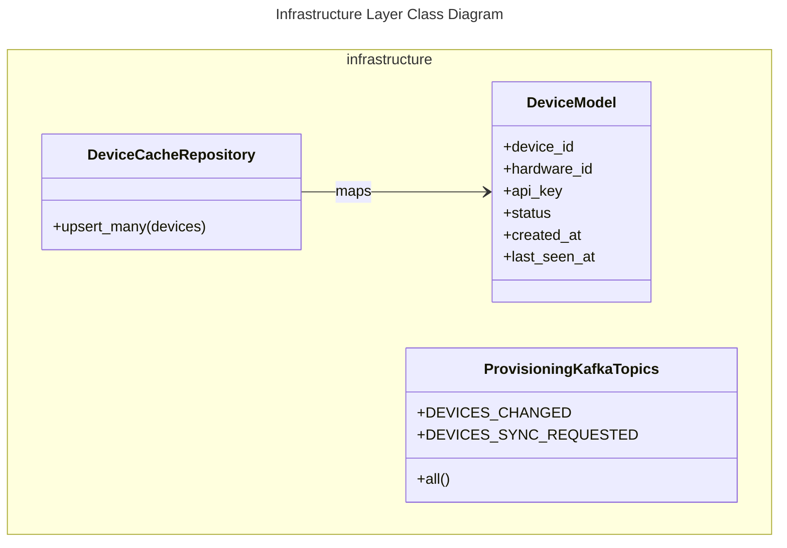

# Provisioning Bounded Context Class Diagrams

This document contains the class diagrams of the **Provisioning Bounded Context** in the Edge application, including the unified view and strictly separated views for each layer.

---

## 1. Unified Diagram

---

## 2. Layer-by-Layer Diagrams

### 2.1. Interfaces Layer

---

### 2.2. Application Layer

---

## 3. Domain Layer

---

## 4. Infrastructure Layer

