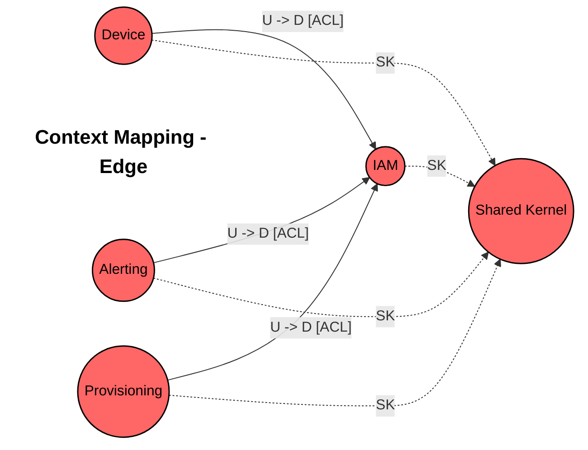

# Context Mapping

This document contains the Context Mapping diagram for the Edge service.

## Context Mapping Diagram

```mermaid
flowchart LR
    %% Context Mapping - Edge

    title["Context Mapping - Edge"]

    IAM(("IAM"))
    Device(("Device"))
    Alerting(("Alerting"))
    Provisioning(("Provisioning"))
    Shared(("Shared Kernel"))

    %% Domain relationships
    Device -->|"U -> D [ACL]"| IAM
    Alerting -->|"U -> D [ACL]"| IAM
    Provisioning -->|"U -> D [ACL]"| IAM

    %% Shared Kernel & Infrastructure dependencies
    IAM -.->|"SK"| Shared
    Device -.->|"SK"| Shared
    Alerting -.->|"SK"| Shared
    Provisioning -.->|"SK"| Shared

    title ~~~ IAM

    classDef context fill:#ff6666,stroke:#000,stroke-width:1.5px,color:#000;
    classDef titleNode fill:transparent,stroke:transparent,color:#000,font-size:22px,font-weight:bold;

    class IAM,Device,Alerting,Provisioning,Shared context;
    class title titleNode;
```
